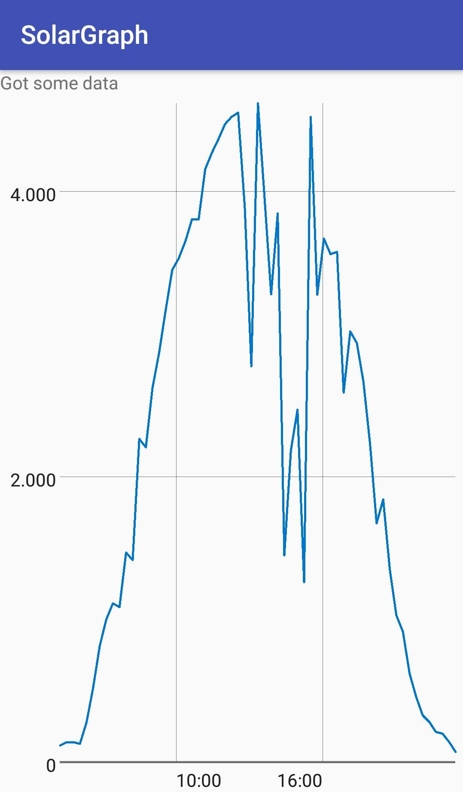

# SolarGraph

View real-time power production of your Autarco PV system.

## Usage

In the GraphActivity.kt, fill in your user name and password.
Compile the application to an APK and run it.
It should show a graph with your PV production data.

## To do

* Add a screen to login and and store the user data somewhere (perhaps in SharedPreferences)
    * There's no support for OAuth on the login endpoint, so the username and password must be stored
* Show more data
    * Production today
    * Production this month
    * Total production
* Use another graph library, this one [doesn't support ConstraintLayout](https://github.com/jjoe64/GraphView/issues/579) in the way I want to use it
