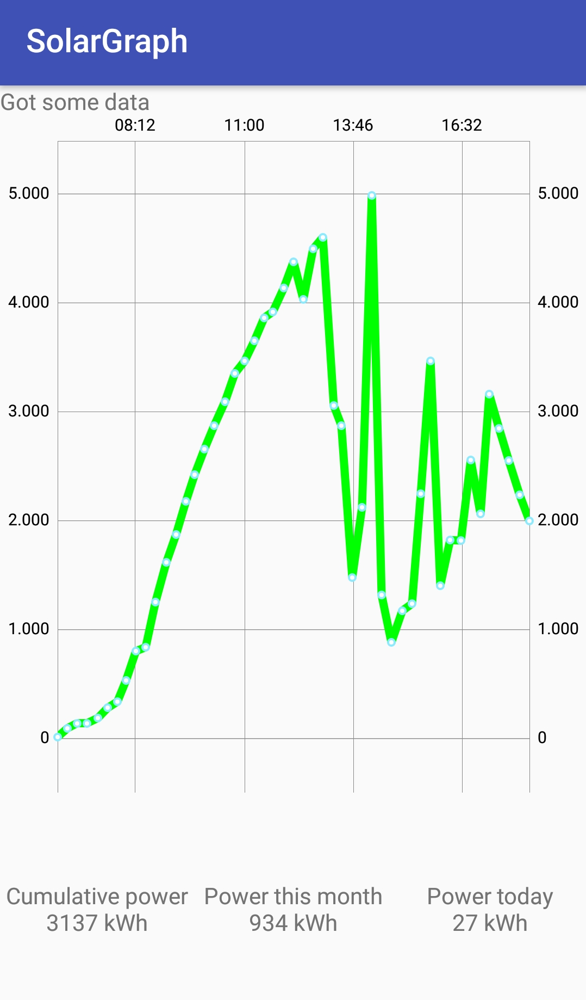

# SolarGraph

View real-time power production of your Autarco PV system.

## Usage

1. Install the application
1. Start the application
1. Fill in username and password, click login
1. It should show a graph with your PV production data
